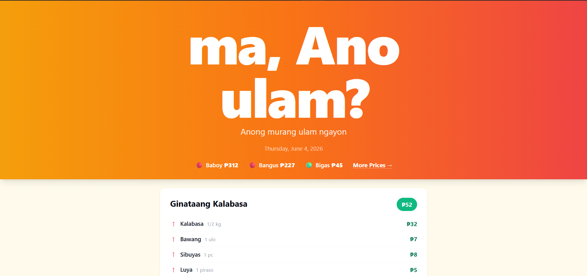
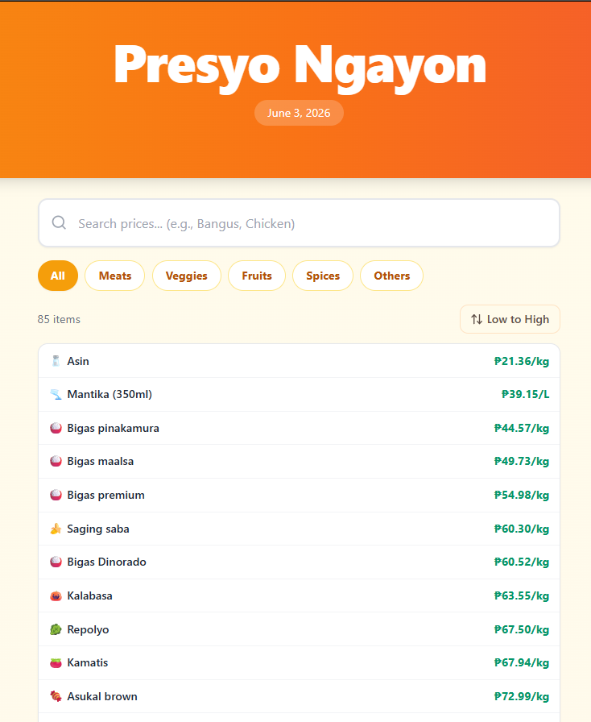
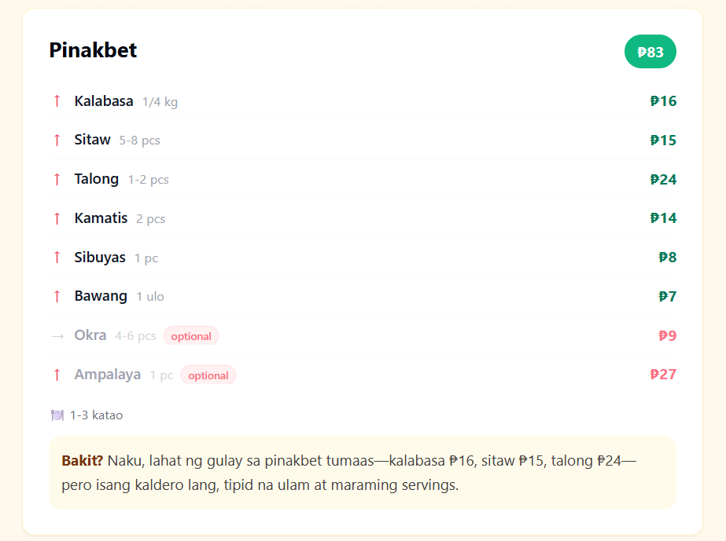
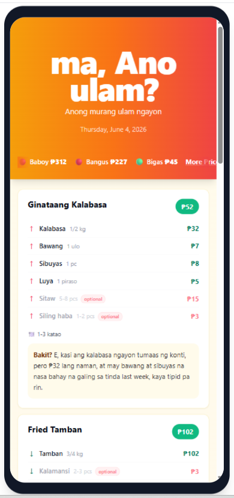

# 🍳 ma, Ano Ulam?

**Daily Filipino meal suggestions based on real market prices.**

Every morning, Ano Ulam? checks today's palengke prices from the Department of Agriculture, runs a 47-recipe cost engine, and shows you the cheapest ulam options for your family — with per-ingredient cost breakdowns and trend arrows.

🔗 **Live:** [ma-anoulam.vercel.app](https://ma-anoulam.vercel.app)

---

## 📸 Screenshots

| Homepage | Price Dashboard |
|----------|----------------|
|  |  |

| Meal Card Detail | Mobile View |
|------------------|-------------|
|  |  |

> 💡 *Screenshots show actual production data from DA Bantay Presyo NCR prices.*

---

## 🤔 What Is This?

**"Ma, ano ulam?"** — every Filipino has asked this question.

Ano Ulam? answers it with math, not guesswork. Instead of AI-generating random recipes (which gets ingredients wrong), it uses a **hardcoded database of 47 verified Filipino recipes** combined with **real daily market prices** from the Department of Agriculture.

The result: accurate meal suggestions with accurate costs, every single day, automatically.

---

## ✨ Features

- 🍲 **47 hardcoded Filipino recipes** — verified ingredients, real palengke quantities
- 📊 **Real DA Bantay Presyo prices** — scraped daily from the Department of Agriculture PDF
- 💰 **Per-ingredient cost breakdown** — see exactly what each ingredient costs today
- 📈 **Trend arrows** — ↑ price went up, ↓ price went down, → unchanged since yesterday
- 🏪 **Receipt-style price dashboard** — browse all ~55-60 commodity prices with search and filters
- 🤖 **Auto-daily via Vercel Cron** — one job, 10 AM Manila, prices then meals in sequence
- 🇵🇭 **Filipino naming** — meat cuts in English, veggies/fish in Filipino (Kamatis, Galunggong, Talong)
- 📱 **Mobile-friendly** — responsive design, works great on phones
- ⚡ **Zero AI calls per visit** — everything is pre-computed and cached. Instant load.
- 📄 **The PDF is read in code, not by an AI** — deterministic, about one second, free
- 🔔 **External watchdog** — a GitHub Action checks the live site daily and raises an issue if the meals disappear

---

## 🔧 How It Works

**One** cron job per day. It runs price ingestion, then meal suggestion, in sequence.

> Two separate crons were tried and retired. Vercel's Hobby plan fires scheduled
> jobs inside a one-hour window, and it fired them out of order, so suggestions
> were generated from the previous day's prices.

```
10:00 AM Manila — /api/cron/daily

  STEP 1 — PRICE INGESTION
    DA Bantay Presyo website
    → Find today's Daily Price Index PDF (the URL changes daily)
    → Download and extract text (pdf-parse)
    → Read the sheet IN CODE (lib/da-parser.ts) — sections, rows, prices
    → If that yields too few rows, fall back to DeepSeek once
    → REFUSE to write if the result is still below the health floor
    → Upsert ~150 commodity prices into Neon PostgreSQL in 2 queries

  STEP 2 — MEAL SUGGESTION
    Pull today's prices from the database
    → Run 47 recipes through the cost engine
    → Apply palengke rate overrides (bawang, sibuyas, luya)
    → Balanced selection: max 2 fish, 2 chicken, 2 pork, 1 beef, 1 egg, 1 veggie
    → Avoid repeating yesterday's picks
    → REFUSE to write if not a single recipe could be costed
    → Send the 8 cheapest to DeepSeek for "Bakit?" reasoning only
    → Cache results in the database

When you visit the site:
    → Read from cache (zero AI calls)
    → Render meal cards with cost breakdowns
    → Done. Fast. Free.
```

Both steps **refuse to overwrite good data with a bad day**. If something upstream
breaks, yesterday's prices and meals stay on the site and the watchdog raises an
issue, rather than the homepage silently going blank.

---

## 🧠 Why Hardcoded Recipes Beat AI Generation

Early versions used DeepSeek to generate recipes on the fly. The results were **6-7/10 accuracy** — wrong ingredients for Filipino dishes, English names instead of local ones, bad cost estimates, and occasionally invented recipes that don't exist.

**The fix:** Hardcode all 47 recipes with verified ingredients and quantities (from actual palengke shopping experience), then use pure math for cost calculation.

Result: **10/10 accuracy.** AI is now used only for natural language reasoning ("Bakit ito ang mura ngayon?"), not for recipe data.

> **Lesson:** For domain-specific structured data (recipes, formulas, calculations), hardcoded databases + math engines outperform AI generation 10:1. Use AI for natural language tasks only.

### The same lesson, learned twice

In July 2026 the site served **zero meals for five days** and nothing reported it.

The model behind the daily PDF extraction had been swapped to `deepseek-v4-flash`.
That is a *reasoning* model, and its hidden reasoning is billed against the same
`max_tokens` budget as its answer. At the old limit of 8192, reasoning consumed
all 8192 tokens and the API returned an **empty string** with no error. The
pipeline dutifully wrote that emptiness over a good day of data.

Raising the limit does produce a correct extraction, but the call then takes ~82
seconds, and Vercel's Hobby plan kills a function at 60.

So the PDF is now read in code (`lib/da-parser.ts`). Measured across the full
17-month DA archive: 140–165 prices per sheet, all 47 recipes costable on every
day of the current layout, in about one second, for free. The department has
reorganised that document twice since March 2025, so the parser handles all three
layouts and matches ingredients on words rather than exact text.

> **Lesson:** an AI step that fails by returning *nothing* is more dangerous than
> one that fails loudly. Check `usage.completion_tokens_details` before trusting a
> quiet response, never write an empty result over good data, and put the health
> check somewhere other than inside the thing it is checking.

---

## 🏗️ Tech Stack

| Layer | Technology |
|-------|------------|
| Framework | Next.js 14 (App Router) |
| Language | TypeScript |
| Styling | Tailwind CSS |
| Database | Neon PostgreSQL (Singapore region) |
| AI | DeepSeek API (`deepseek-v4-flash`) — prose and fallback only |
| Hosting | Vercel (Hobby plan) |
| PDF Parsing | pdf-parse v2 |
| Scheduling | Vercel Cron Jobs (one combined job, 10 AM Manila) |
| Data Source | DA Bantay Presyo — Daily Price Index NCR |
| Analytics | Vercel Web Analytics |

---

## 📄 Pages

### `/` — Homepage
The main experience. Ticker-style hero showing 6 key commodity prices with 🟢🔴 indicators. Eight meal cards with per-ingredient cost breakdowns, trend arrows, green (required) and rose (optional) ingredient badges. ₱0 optional ingredients are automatically hidden.

### `/prices` — Presyo Ngayon
Receipt-style single-column price list. Each row shows an emoji, commodity name, and today's price. Color-coded: green (≤₱100), amber (≤₱250), red (₱251+). Includes search bar, 6 category filter pills, and sort toggle.

### `/about` — About
Mission, data source, how the engine works (3 steps), tech stack, and creator information.

---

## 💰 Cost Breakdown

| Service | Monthly Cost |
|---------|-------------|
| Vercel Hosting | $0 (Hobby plan) |
| Neon PostgreSQL | $0 (Free tier) |
| DeepSeek API | under $0.05 (prose only; the price sheet is read in code) |
| Domain | $0 (using .vercel.app) |
| **Total** | **under $0.05/month** |

---

## 📊 Data Source

All commodity prices come from the **Department of Agriculture — Bantay Presyo** program.

The system scrapes the [DA Daily Price Monitoring page](https://da.gov.ph) every morning for the latest **Daily Price Index** PDF covering the **National Capital Region (NCR)**.

Prices reflect prevailing rates at major Metro Manila wet markets and supermarkets.

---

## 🚀 Local Development

```bash
# Clone the repository
git clone https://github.com/chanrylejay/ano-ulam.git
cd ano-ulam

# Install dependencies
npm install

# Set up environment variables
cp .env.example .env.local
# Fill in:
#   DATABASE_URL=your_neon_connection_string
#   DEEPSEEK_API_KEY=your_deepseek_api_key
#   CRON_SECRET=your_cron_secret

# Run development server
npm run dev
```

Open [http://localhost:3000](http://localhost:3000) to see the app.

To manually trigger the daily pipeline:

```bash
# The whole thing, ingestion then suggestions, exactly as the cron runs it
curl -X POST "http://localhost:3000/api/cron/daily" -H "x-cron-secret: your_cron_secret"

# Or either half on its own, for debugging
curl -X POST "http://localhost:3000/api/cron/ingest"  -H "x-cron-secret: your_cron_secret"
curl -X POST "http://localhost:3000/api/cron/suggest" -H "x-cron-secret: your_cron_secret"
```

> All three routes require `CRON_SECRET`. Pointed at the production URL they write
> to the live database and spend real DeepSeek credit, so treat that as a deploy.

Check the live site's health the same way the watchdog does:

```bash
node .github/scripts/watchdog.mjs          # exits non-zero if the site is unhealthy
SITE_URL=http://localhost:3000 node .github/scripts/watchdog.mjs
```

---

## 📁 Project Structure

```
app/
  page.tsx                    # Homepage
  prices/page.tsx             # Price dashboard
  about/page.tsx              # About page
  layout.tsx                  # Root layout + Analytics
  api/
    cron/
      ingest/route.ts         # DA PDF scraping + price ingestion
      suggest/route.ts        # Meal suggestion generation
    prices/route.ts           # Prices API endpoint
    suggestions/route.ts      # Suggestions API endpoint
lib/
  db.ts                       # Neon PostgreSQL connection
  deepseek.ts                 # DeepSeek client ("Bakit?" prose + fallback reader)
  da-parser.ts                # Reads the DA PDF in code, no AI (V2.3)
  commodity-names.ts          # Smart commodity name mapping (V3)
  recipes.ts                  # 47-recipe database + cost engine (V3)
components/
  MealCard.tsx                # Meal card with cost breakdown (V2)
  Footer.tsx                  # Contact + DA attribution + credits
vercel.json                   # Cron job configuration (one job, 0 2 * * * UTC)
.github/
  workflows/watchdog.yml      # Daily live-site health check
  scripts/watchdog.mjs        # Opens an issue when the homepage loses its meals
```

---

## 👨‍💻 Created By

**Chanryle Jay Cagara**
AI Automation & Technical Operations Specialist

- 🌐 [Portfolio](https://chanryle-cagara.vercel.app)
- 💼 [LinkedIn](https://linkedin.com/in/chanrylejay)
- 🐙 [GitHub](https://github.com/chanrylejay)
- 📧 chanrylecagara@gmail.com

---

## 📜 License

This project is licensed under the [MIT License](LICENSE).

---

> *"Ma, ano ulam?" — answered by math, not guesswork.*
